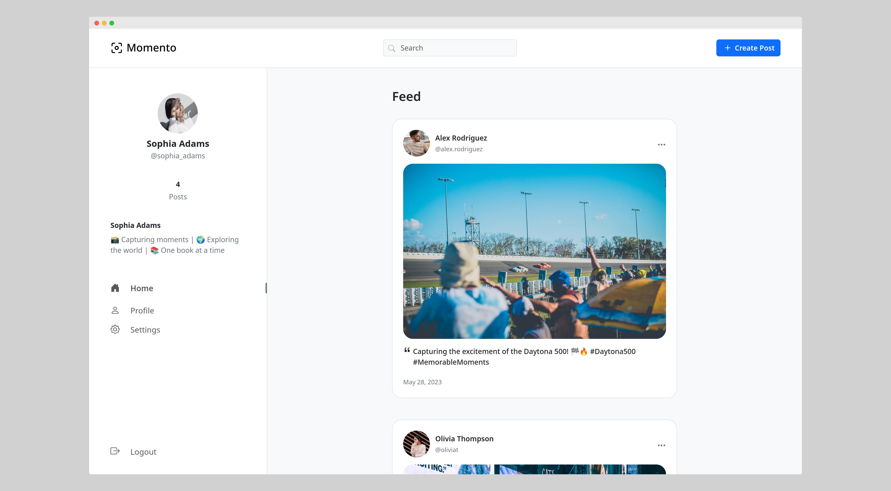
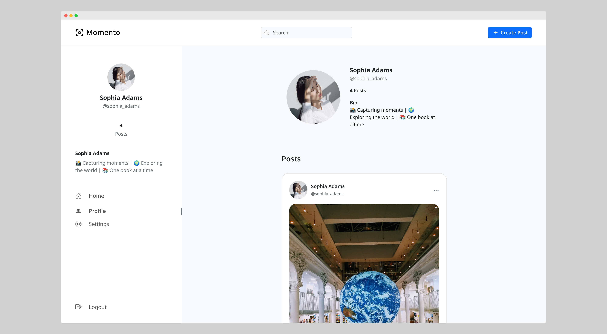
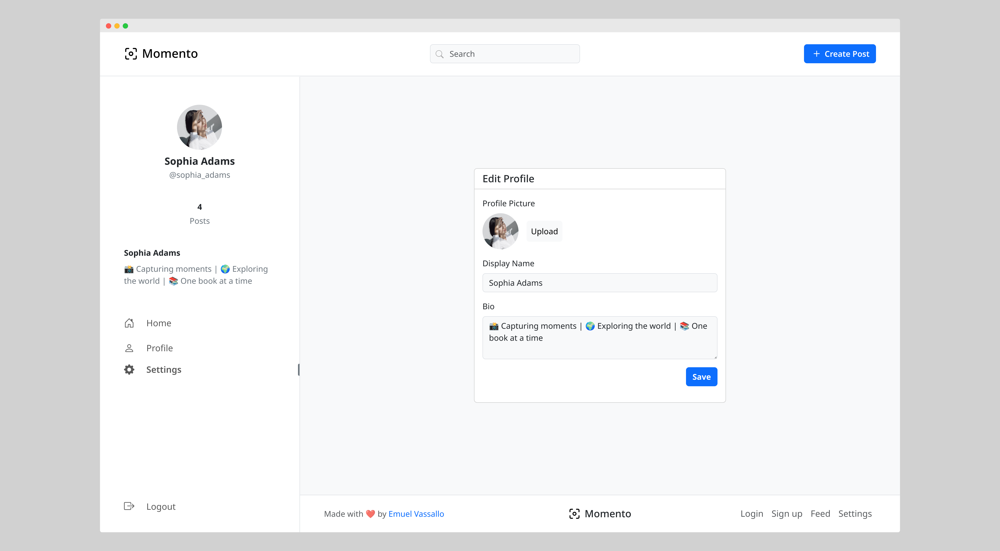
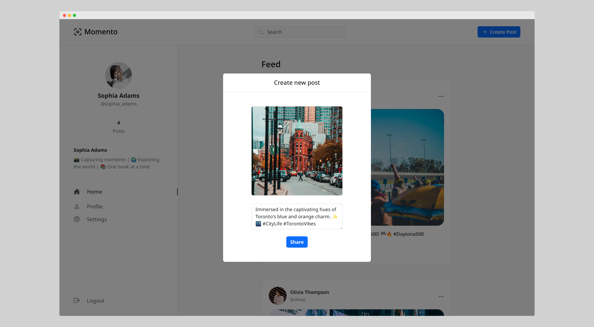

# Momento

Simple photo-sharing social media platform

### [Live Demo](https://momento.emuel.me)

---

## 📚 About

__Momento__ is a simple full-stack social media platform built with PHP, MySQL, and Bootstrap, serving as an example of implementing the core functionalities within a social media platform.

## 📷️ Showcase

### Home Page

  

### Profile Page

### Edit Profile

### Create Post

## 🛠️ Technologies

- PHP
- MySQL
- HTML
- JavaScript
- CSS
- Bootstrap

## ⚙️ Installation and Setup

To install and set up the project, follow the instructions below:

### Prerequisites
- XAMPP installed on your machine. You can download XAMPP from the official website: https://www.apachefriends.org/

### Installation Steps

1. Clone the repository using `git clone https://github.com/emuel-vassallo/instagram-clone`
2. Move the project files to the appropriate directory:
   - Windows: Extract the files to `C:\xampp\htdocs\instagram-clone`.
   - Linux: Extract the files to `/opt/lampp/htdocs/instagram-clone`.
   - Mac: Extract the files to `/Applications/XAMPP/htdocs/instagram-clone`.
3. Start Apache and MySQL from XAMPP.
4. Open your web browser and go to [http://localhost/phpmyadmin](http://localhost/phpmyadmin). This will open the phpMyAdmin interface.
5. Click on "New" on the left hand side, and create a new database named "InstaCloneDB".
6. Click on "Import" at the top.
7. Click "Browse" and select the db_setup.sql file from the cloned project directory's "sql" folder, then click the 'Import' button to import the database structure into the database.
8. (Optional) To include example profiles with posts, import the data_insertions.sql file from the "sql" folder in the cloned project directory.
9. Once the database import is complete, navigate to http://localhost/instagram-clone in your web browser to run the project on your localhost.

## 🌟 Key Features

### Profile Customisation

- Ability for users to customise their profiles, including profile pictures, display names, and bios.

### Post Editing

- Allow users to modify and update their published posts.

### Search Functionality

- Instantly find users based on their usernames and display names with live search results.
- Powered by [MiniSearch](https://lucaong.github.io/minisearch/), enabling efficient and accurate search functionality within th🙏e app.

### Copy Post Link

- Enable users to easily share the link of a post with others.

## ✅ TODO

### High Priority

- [ ] Post liking
- [ ] Follow users
- [ ] Commenting system
- [ ] Dark theme toggle
- [ ] Notifications

### Additional Features

- [ ] "See First" feature to prioritize specific accounts in the feed
- [ ] Choose interests on account creation
- [ ] Google sign-in
- [ ] Mass delete
- [ ] Multiple feed view modes
- [ ] NSFW content filter
- [ ] Pin posts on profile
- [ ] Post download
- [ ] Regram functionality to allow post sharing within the platform
- [ ] Reorder posts
- [ ] Schedule posts

## 🙏 Acknowledgements

- [JustValidate](https://just-validate.dev/): Enables smooth form validation and accurate user input in forms.
- [Unsplash](https://unsplash.com/): Used for providing high quality and royalty-free images.
