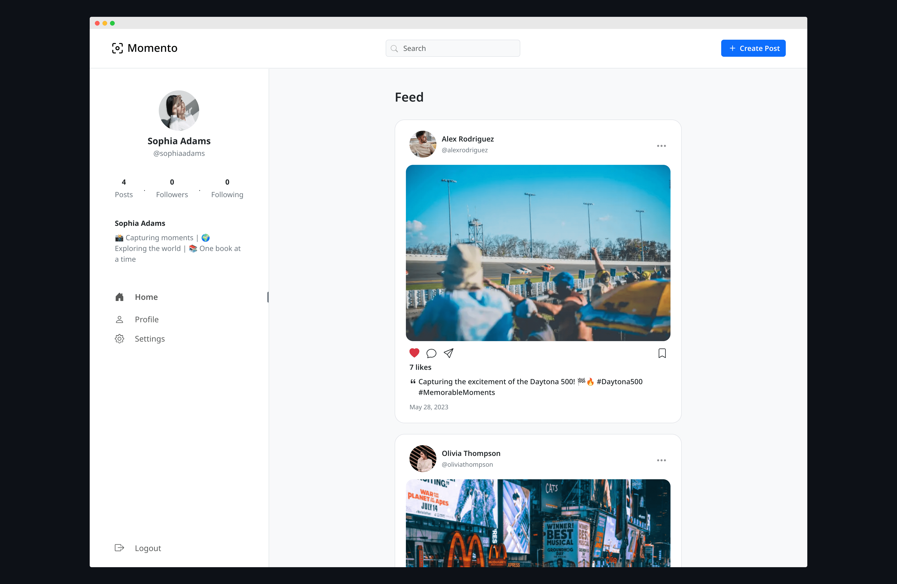
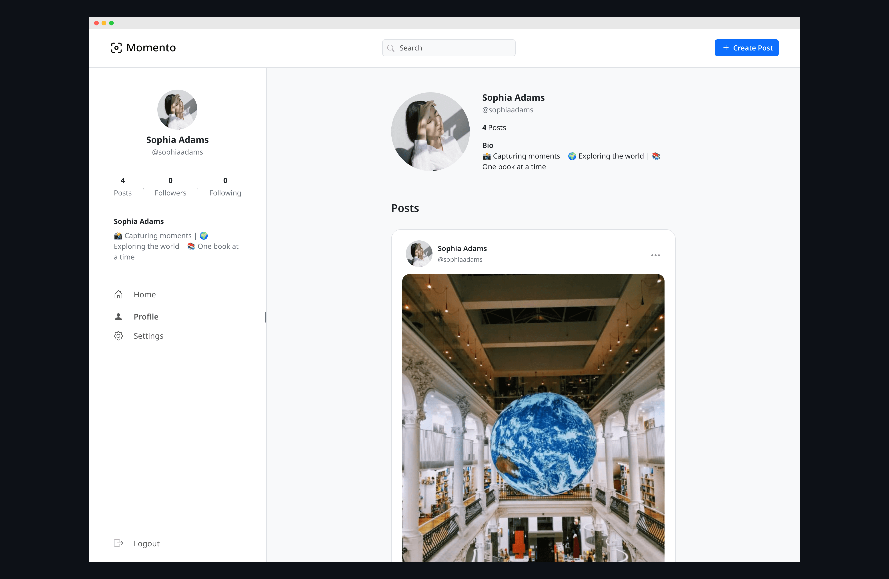
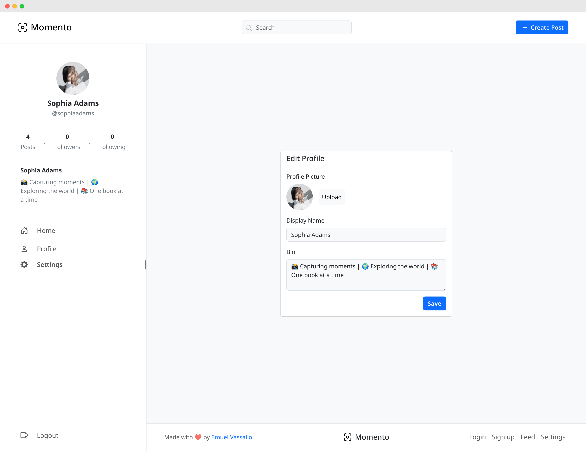
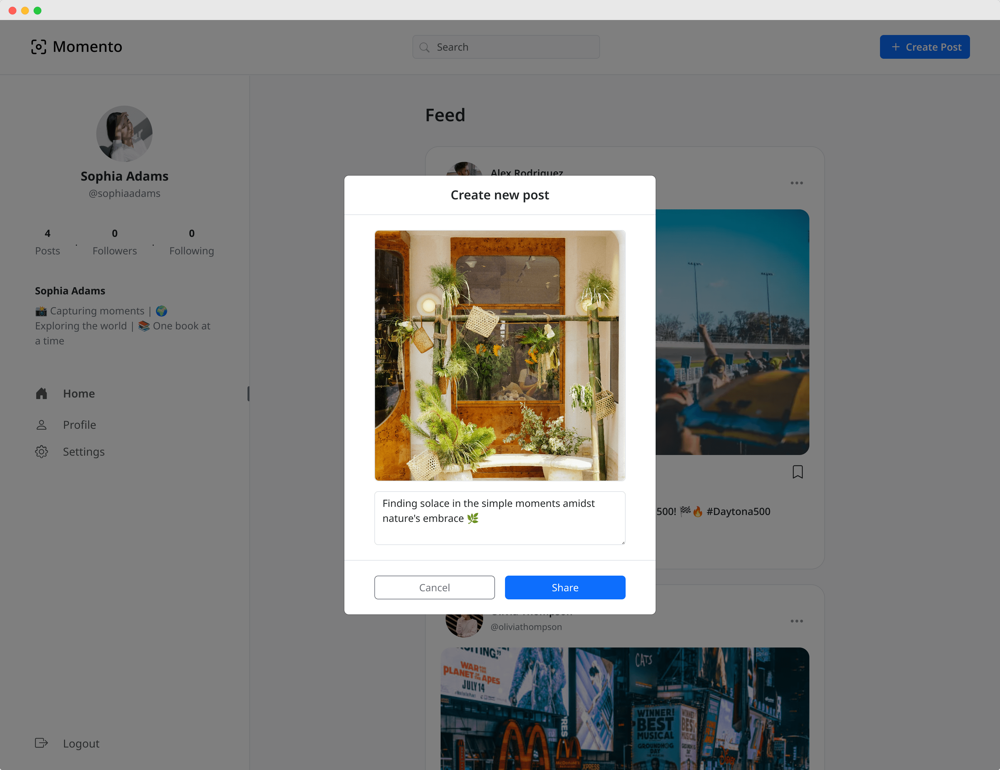

# Momento

Simple photo-sharing social media platform

### [Live Demo](https://momentoapp.emuel.me)

---

## 📚 About

__Momento__ is a simple full-stack social media platform built with PHP, MySQL, and Bootstrap, serving as an example of implementing the core functionalities within a social media platform.

## 📷️ Showcase

### Home Page

  

### Profile Page



### Edit Profile



### Create Post



## 🛠️ Technologies

- PHP
- MySQL
- HTML
- JavaScript
- CSS
- Bootstrap
- Cloudinary API

## ⚙️ Installation and Setup

To install and set up the project, follow the instructions below:

### Prerequisites
Before you proceed with the installation, make sure you have the following prerequisites:

- PHP version 8.1 or greater.
- Composer. 
- XAMPP, which can be downloaded from official website: https://www.apachefriends.org/
- Cloudinary account with API access keys. You can create a new account here: https://cloudinary.com/

### Before Running the Project

1. Open the Cloudinary Management Console by visiting the [Cloudinary](https://console.cloudinary.com/console), go to Media Library, and create a folder called `momento`.
2. Inside the `momento` folder, create two additional folders called `posts` and `profile-pictures`. Momento will use these folders to store uploaded post images and user profile pictures.

### Installing and Running the Project

1. Clone the repository using `git clone https://github.com/emuel-vassallo/momento`
2. Move the project files to the appropriate directory:
   - Windows: Extract the files to `C:\xampp\htdocs\momento`.
   - Linux: Extract the files to `/opt/lampp/htdocs/momento`.
   - Mac: Extract the files to `/Applications/XAMPP/htdocs/momento`.
3. Start Apache and MySQL from XAMPP.
4. Open your web browser and go to [http://localhost/phpmyadmin](http://localhost/phpmyadmin). This will open the phpMyAdmin interface.
5. Click on "New" on the left-hand side and create a new database named "momento_db".
6. Click on "Import" at the top.
7. Click "Browse" and select the `db_setup.sql` file from the cloned project directory's `sql` folder, then click the 'Import' button to import the database structure into the database.
8. (Optional) To include example profiles with posts, import the `data_insertions.sql` file from the `sql` folder in the cloned project directory.
9. Rename the `.htaccess.example` file found in the `public_html` folder to `.htaccess`.
10. Open the `.htaccess` file and enter your Cloudinary API cloud name and access keys. For example:

```objectivec
# .htaccess

SetEnv CLOUDINARY_CLOUD_NAME "your_cloud_name"
SetEnv CLOUDINARY_API_KEY "your_api_key"
SetEnv CLOUDINARY_API_SECRET "your_api_secret"
```

Make sure to replace `"your_cloud_name"`, `"your_api_key"`, and `"your_api_secret"` with your actual Cloudinary API credentials.

11. Run the following command in the project root directory to install the required dependencies using Composer:

```
composer install
```

12.  Finally, navigate to [http://localhost/momento](http://localhost/momento) in your web browser to run the Momento project on your localhost.

By following these steps, you will be able to run the Momento project on your local machine.


## 🌟 Key Features

### Profile Customisation

- Ability for users to customise their profiles, including profile pictures, display names, and bios.

### Post Editing

- Allow users to modify and update their published posts.

### Search Functionality

- Instantly find users based on their usernames and display names with live search results.
- Powered by [MiniSearch](https://lucaong.github.io/minisearch/), enabling efficient and accurate search functionality within th🙏e app.

### Copy Post Link

- Enable users to easily share the link of a post with others.

## ✅ TODO

### High Priority

- [x] Post liking
- [ ] Follow users
- [ ] Commenting system
- [ ] Dark theme toggle
- [ ] Notifications

### Additional Features

- [ ] "See First" feature to prioritize specific accounts in the feed
- [ ] Choose interests on account creation
- [ ] Google sign-in
- [ ] Mass delete
- [ ] Multiple feed view modes
- [ ] NSFW content filter
- [ ] Pin posts on profile
- [ ] Post download
- [ ] Regram functionality to allow post sharing within the platform
- [ ] Reorder posts
- [ ] Schedule posts

## 🙏 Acknowledgements

- [JustValidate](https://just-validate.dev/): Enables smooth form validation and accurate user input in forms.
- [Unsplash](https://unsplash.com/): Used for providing high quality and royalty-free images.
