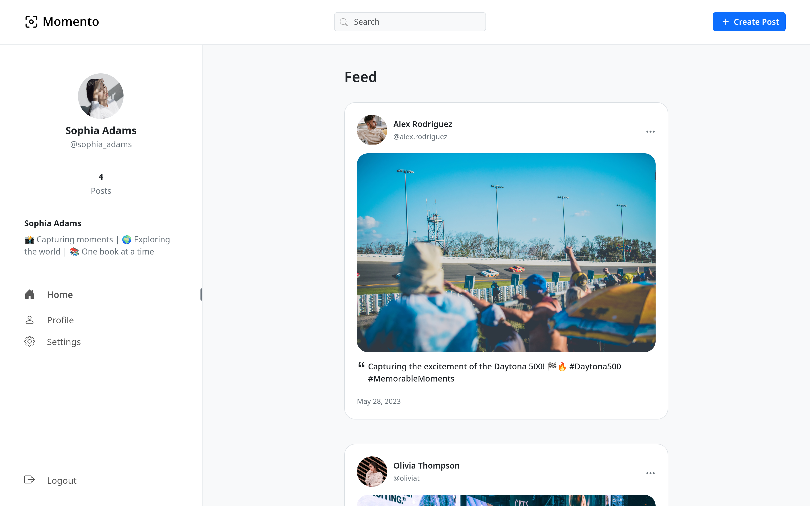
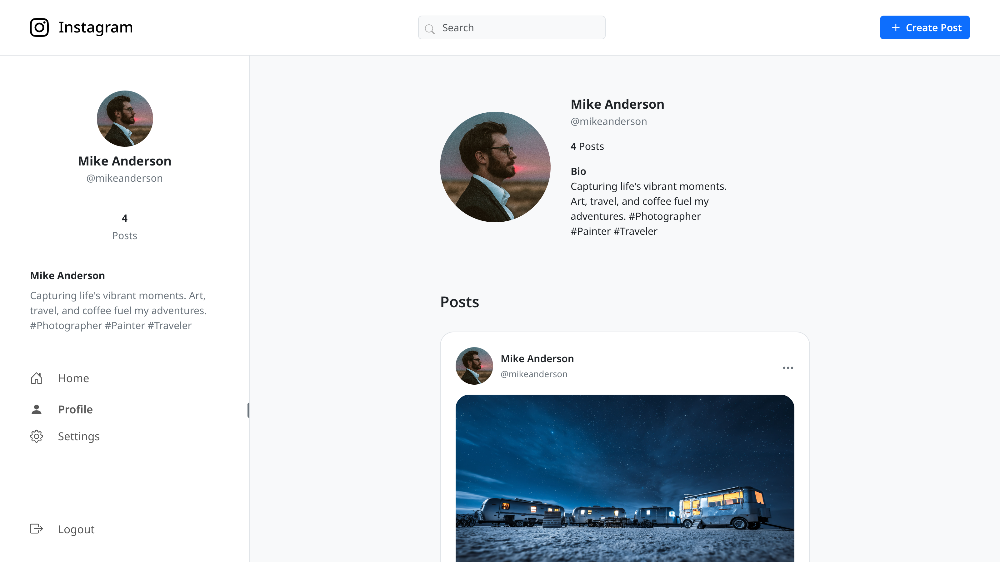
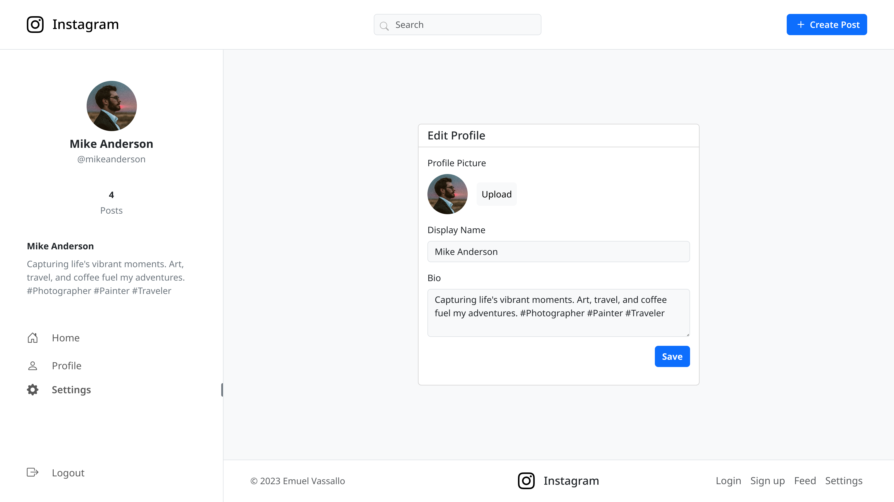
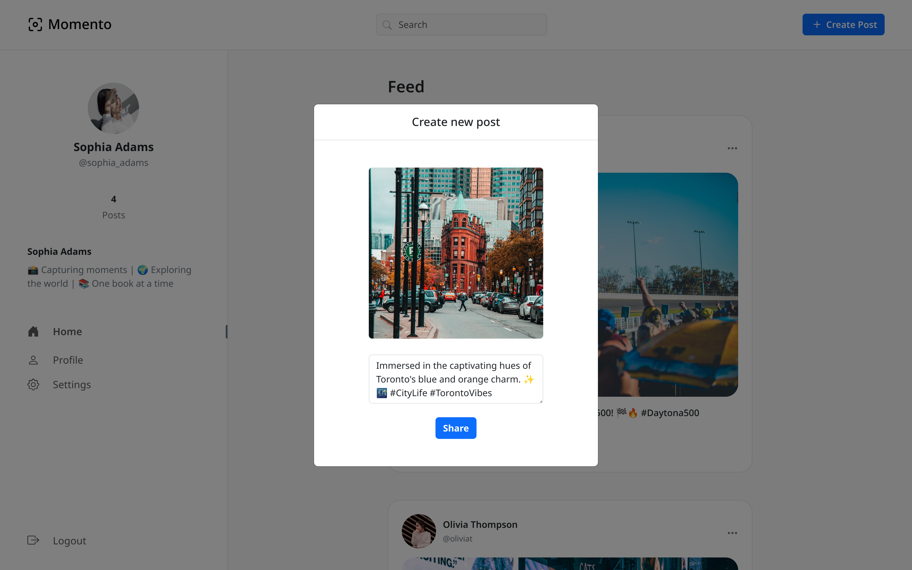
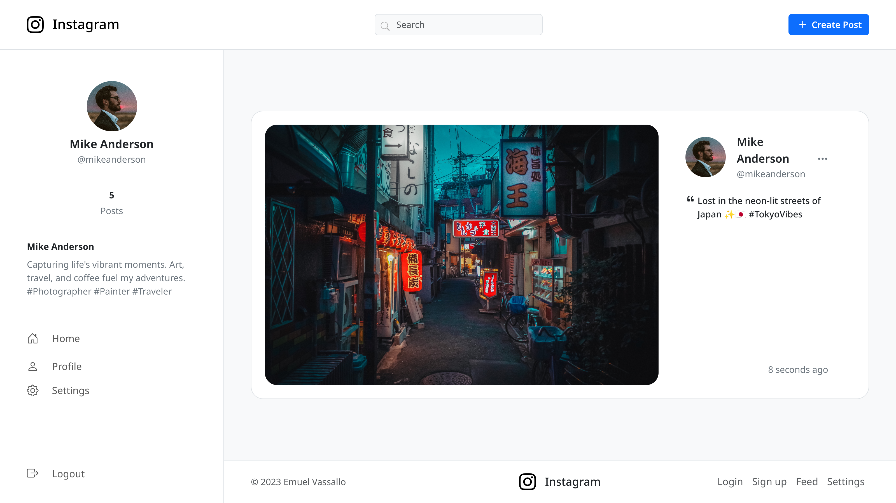

# Instagram Clone

An Instagram clone built with PHP, MySQL, HTML, JavaScript, CSS, and Bootstrap. This project serves as an example of implementing the fundamental operations in a social media platform, featuring a redesigned user interface.

### [Live Demo](https://emuel-ig-clone.000webhostapp.com)

## Showcase

### Home

### Profile

### Edit Profile

### Add Post

### Post Page

## Technologies

- PHP
- MySQL
- HTML
- JavaScript
- CSS
- Bootstrap

## Key Features

### Profile Customisation

- Ability for users to customise their profiles, including profile pictures, display names, and bios.

### Post Editing

- Allow users to modify and update their published posts.

### Search Functionality

- Instantly find users based on their usernames and display names with live search results.
- Powered by [MiniSearch](https://lucaong.github.io/minisearch/), enabling efficient and accurate search functionality within the app.

### Copy Post Link

- Enable users to easily share the link of a post with others.

## TODO

### High Priority

- [ ] Implement post liking functionality
- [ ] Enable user following feature
- [ ] Add dark theme toggle

### Additional Features

- [ ] Google sign-in for seamless authentication
- [ ] Multiple feed view modes
- [ ] Regram functionality to allow post sharing within the platform
- [ ] Mass delete
- [ ] Post download
- [ ] Schedule posts
- [ ] Pin posts on profile
- [ ] Add "See First" feature to prioritize specific accounts in the feed
- [ ] Choose interests on account creation
- [ ] Reorder posts

## Acknowledgements

- [JustValidate](https://just-validate.dev/): Enables smooth form validation and accurate user input in forms.
- [Unsplash](https://unsplash.com/): Used for providing dummy profile pictures and posts.

